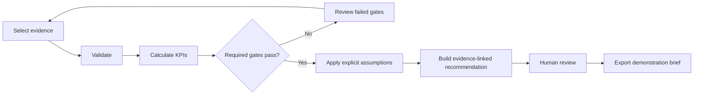
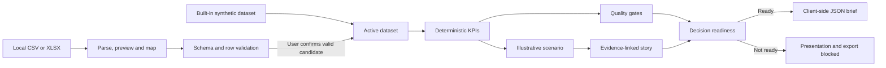

# DecisionDeck Lab

[](https://github.com/Falichen-analytics/decisiondeck-lab/actions/workflows/ci.yml)
[](LICENSE)

Turn validated data, explicit assumptions and transparent scenarios into an
auditable executive decision story.

DecisionDeck Lab is a static, browser-based analytics portfolio application
built around a fictional healthcare triage case. It connects local CSV/XLSX
import, data-quality controls, deterministic KPIs, scenario modelling,
evidence-linked recommendations and management communication in one workflow.

**Live demo:** planned for Phase 3 using GitHub Pages. No public deployment is
available yet.

## Independent portfolio demonstration

> DecisionDeck Lab is an independent portfolio demonstration using fictional
> and synthetic healthcare triage data. It is not affiliated with, endorsed by
> or representative of any healthcare organisation or clinical programme.

The project is not a medical device, contains no clinically validated model and
must not be used for patient-care decisions.

## Target users

- data analysts who need to connect data quality, metrics and recommendations;
- business analysts preparing an evidence-based decision for management;
- BI and operations analysts translating operational data into an executive
  narrative;
- reviewers assessing whether an analytical conclusion is traceable and ready
  to present.

## Business problem

Management reporting often separates data preparation, KPI calculation,
scenario assumptions and presentation writing. That separation can make it
difficult to see whether a recommendation is supported by validated evidence.

DecisionDeck Lab demonstrates a controlled alternative:

1. select a synthetic or local dataset;
2. validate its structure and values;
3. calculate transparent performance metrics;
4. evaluate required quality gates;
5. model an illustrative scenario using explicit assumptions;
6. connect the findings to an executive recommendation;
7. block the final brief when required evidence is not ready.

## Key features

- immutable built-in synthetic demonstration data;
- local browser-only CSV and XLSX processing;
- sheet preview and explicit column mapping;
- row-level validation and corrective guidance;
- separate active dataset, import candidate and validated candidate states;
- deterministic KPI and scenario functions;
- calculated evidence coverage and decision readiness;
- required quality gates that block presentation and JSON export when they
  fail;
- active-dataset provenance without local paths or imported rows;
- responsive, presentation-oriented interface;
- labelled controls, live status messages and keyboard-operable analysis tabs;
- automated behavioural, calculation and publication checks.

## Analytics workflow



See [Analytics workflow](docs/analytics-workflow.md) for metric, gate, scenario
and decision-story responsibilities.

## Why this matters to analysts

The project demonstrates more than frontend presentation. It shows how an
analyst can:

- define and enforce an input contract;
- distinguish source data from calculated values and assumptions;
- make KPI calculations reproducible;
- prevent poor-quality evidence from producing a successful-looking output;
- communicate scenario uncertainty without presenting a projection as a
  forecast;
- preserve traceability from an executive claim back to data, metrics, gates or
  assumptions;
- explain a technical workflow to a non-technical decision-maker.

## Architecture overview



Everything runs in the browser. There is no backend, live AI model,
authentication service or external file-processing API. See
[Architecture](docs/architecture.md) for the component boundaries and data
flow.

## Local installation

### Requirements

- Node.js `22.13.0` (recorded in `.node-version`);
- pnpm `11.9.0`;
- a modern browser.

### Run locally

```bash
git clone https://github.com/Falichen-analytics/decisiondeck-lab.git
cd decisiondeck-lab
pnpm install --frozen-lockfile
pnpm dev
```

Open the local URL printed by Vite.

### Production preview

```bash
pnpm build
pnpm preview
```

## CSV/XLSX import schema

The seven required fields are:

| Field | Accepted value |
| --- | --- |
| `id` | Unique, non-empty text identifier |
| `category` | `Chest pain`, `Breathing difficulty`, `Neurological` or `Other acute` |
| `complete` | Exact lowercase CSV value `true` or `false`; native XLSX boolean also accepted |
| `safetyCritical` | Exact lowercase CSV value `true` or `false`; native XLSX boolean also accepted |
| `referenceUrgency` | `A0`, `A1`, `A2`, `C1` or `C2` |
| `predictedUrgency` | `A0`, `A1`, `A2`, `C1` or `C2` |
| `assessmentMinutes` | Finite positive number without grouping symbols |

Use the public [32-row synthetic CSV example](examples/sample-triage-cases.csv)
or review the complete [sample-data schema](docs/sample-data-schema.md).

## Validation rules

- Surrounding whitespace is trimmed; internal whitespace is preserved.
- Categories and urgency codes remain case-sensitive after trimming.
- CSV booleans accept only exact lowercase `true` and `false`.
- Blank and duplicate headers are rejected.
- Every required field must be mapped once.
- Missing cells, duplicate IDs and invalid values are reported by row.
- Extra unmapped columns are allowed.
- Files are limited to 5 MB, 5,000 data rows and 100 columns.
- The preview shows up to 20 rows.
- Only `.csv` and `.xlsx` are supported.
- `.xls`, `.xlsm`, encrypted and unsupported workbooks are rejected.
- Spreadsheet formulas are not executed. A formula in a required mapped XLSX
  field blocks import, even when a cached value is available.
- The active dataset does not change until validation succeeds and the user
  explicitly confirms activation.

## Testing and continuous integration

```bash
pnpm lint
pnpm typecheck
pnpm test
pnpm build
```

The automated suite covers deterministic metrics, scenarios, gate enforcement,
blocked and successful exports, CSV/XLSX validation behaviour, candidate
lifecycle, provenance and publication checks. GitHub Actions runs the same
quality commands for pull requests targeting `main` and pushes to `main`.

## Privacy and synthetic-data boundaries

- The built-in cases and public example CSV are generated and fictional.
- No real patients, clinicians, healthcare organisations or operational
  systems are represented.
- Selected CSV/XLSX files are parsed locally and retained only in browser
  memory.
- Imported rows are not written to localStorage, IndexedDB or cookies.
- The JSON evidence export includes safe provenance but excludes imported rows,
  local paths, usernames and machine metadata.
- Users must not select identifiable, confidential, regulated or commercially
  sensitive records in the public demonstration.

Local processing reduces data movement; it is not a complete privacy,
governance or clinical-safety control.

## Media

Verified screenshots and a short workflow demonstration will be added during
Phase 3 using only the running application and synthetic data. The capture plan
is documented in [Media plan](docs/media-plan.md). No placeholder image or fake
demo URL is used.

## Limitations

- The urgency reference values and thresholds are demonstration rules, not a
  clinically validated reference standard.
- Scenario outputs are illustrative projections based on the active sample and
  user-entered assumptions; they are not forecasts.
- The application has no user accounts, collaboration, persistent projects or
  server-side audit store.
- Imported data remains in memory and is lost on refresh.
- Accessibility features have received practical keyboard and responsive smoke
  testing, not formal WCAG certification.
- JSON is the only implemented decision-brief export.
- Baseline comparison, AI assistance and PowerPoint export are planned or
  optional ideas, not current capabilities.

## Roadmap

- verified screenshots and short demonstration;
- GitHub Pages static deployment;
- automated accessibility and link checks;
- baseline comparison;
- automatic data profiling and a central KPI dictionary;
- optional project snapshots;
- optional evidence-grounded narrative assistance;
- optional editable PowerPoint export.

## Project documentation

- [Architecture](docs/architecture.md)
- [Analytics workflow](docs/analytics-workflow.md)
- [Sample-data schema](docs/sample-data-schema.md)
- [Media capture plan](docs/media-plan.md)
- [Third-party notices](THIRD_PARTY_NOTICES.md)

## Licence

DecisionDeck Lab is available under the [MIT License](LICENSE). Third-party
packages remain subject to their own licences, as listed in
[Third-party notices](THIRD_PARTY_NOTICES.md).
