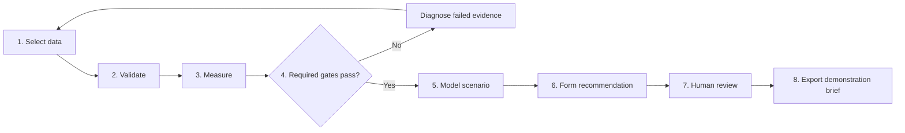
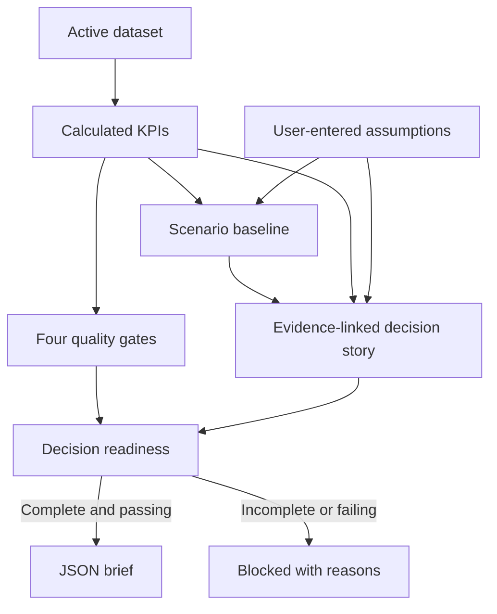

# Analytics Workflow

DecisionDeck Lab demonstrates how evidence can move from controlled input to an
executive recommendation without mixing measured facts, assumptions and
narrative.

## End-to-end workflow

## Evidence chain

## Workflow stages

### 1. Select data

The analyst starts with the immutable 48-row synthetic dataset or selects a
local CSV/XLSX file. File selection creates an import candidate; it does not
replace the active dataset.

### 2. Validate

The import harness checks file limits, headers, mapping, required cells,
identifiers, case-sensitive enums, booleans, numbers and formulas. Issues are
reported by row with suggested corrective action. Only a valid candidate can
be confirmed as active.

### 3. Measure

The same calculation functions process the current active dataset:

| KPI | Calculation |
| --- | --- |
| Total cases | Number of active rows |
| Agreement | Exact prediction/reference matches ÷ total cases |
| Completeness | Rows marked complete ÷ total cases |
| Escalation rate | Predictions in A0, A1 or A2 ÷ total cases |
| Safety-critical recall | Safety-critical rows predicted A0, A1 or A2 ÷ safety-critical rows |
| Average assessment | Sum of assessment minutes ÷ total cases |
| Duplicate IDs | Row count minus distinct-ID count |

### 4. Apply quality gates

| Gate | Demonstration threshold |
| --- | --- |
| Data completeness | At least 95% |
| Duplicate identifiers | Exactly 0 |
| Overall agreement | At least 85% |
| Safety-critical recall | At least 80% |

A failed gate changes readiness immediately and blocks final presentation and
JSON export. These thresholds are illustrative analytical controls, not a
clinical standard.

### 5. Model an illustrative scenario

The scenario uses:

- the active sample's calculated escalation rate;
- user-entered monthly volume;
- user-entered avoidable-escalation reduction;
- user-entered illustrative cost per escalation;
- an illustrative 22-minute release assumption.

Outputs are projections for discussion, not validated forecasts. The interface
shows the active sample size, numerator, denominator and assumptions. Samples
below 30 rows receive an interpretation warning.

### 6. Form a recommendation

The decision story separates:

- measured facts from the active dataset;
- calculated KPI and gate results;
- scenario assumptions;
- illustrative scenario outputs;
- management recommendations;
- limitations and required human review.

### 7. Review and export

Evidence coverage is the percentage of required evidence items that are
available. Export is allowed only when all four gates pass and evidence
coverage is 100%. The generated JSON remains a demonstration brief and does not
represent clinical approval.

## Reproducibility

Calculations are deterministic pure functions. Repeating them with the same
active dataset and assumptions produces the same KPI, gate and scenario
results. Imported files themselves are not persisted, so reproducing an
imported analysis also requires retaining the original reviewed source file
outside the application.
