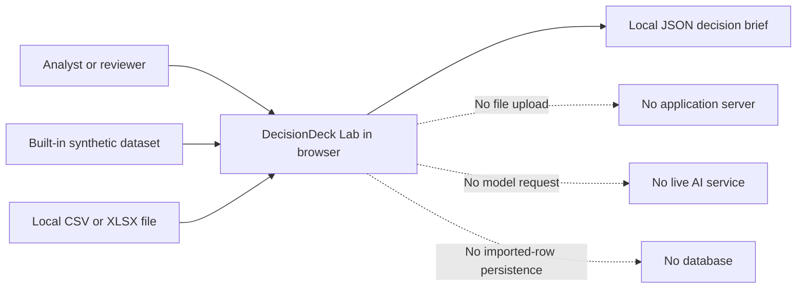
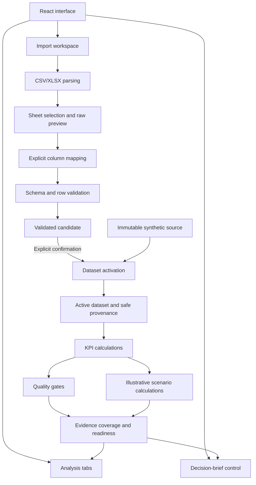
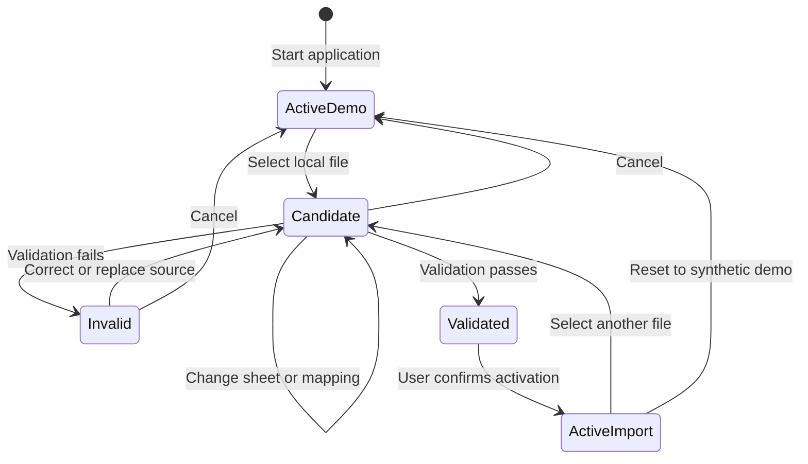

# Architecture

DecisionDeck Lab is a static React and TypeScript application. All application
logic runs in the browser. It has no backend, live AI service, authentication
layer, database or external file-processing API.

## System context

The dashed connections describe deliberately absent services. Local file
contents remain in browser memory and are not transmitted by the application.

## Browser application layers

## Import safety boundary

The active dataset never changes merely because a file was selected, parsed or
validated. Activation requires a valid result and a separate user confirmation.

## Module responsibilities

| Area | Responsibility |
| --- | --- |
| `src/components/` | Interface, interaction states, focus and status messaging |
| `src/import/parsers.ts` | Local CSV/XLSX parsing and file-level limits |
| `src/import/mapping.ts` | Header analysis and mapping suggestions |
| `src/import/validation.ts` | Required-field, type, enum, formula and duplicate checks |
| `src/import/activation.ts` | Controlled candidate activation and provenance |
| `src/core/metrics.ts` | KPI, gate and scenario calculations |
| `src/core/decision.ts` | Evidence coverage, readiness and guarded export |
| `src/data/` | Immutable fictional demonstration data |
| `tests/` | Calculation, import, gate and publication behaviour |

## Data and trust boundaries

- Imported rows are held in React state and are not persisted.
- Dataset provenance may include the original filename and selected sheet, but
  never a local absolute path.
- The exported JSON brief contains calculated evidence and safe provenance, not
  the imported source rows.
- Quality-gate failures prevent a successful decision brief.
- Scenario assumptions remain separate from measured data.
- A future backend or AI service would require a new privacy, authentication,
  authorisation and audit architecture; none is implied by this version.

## Deployment shape

The production output is a static Vite build containing HTML, CSS and
JavaScript. Production builds use the `/decisiondeck-lab/` base path, while
local development uses `/`. The repository contains a separate, manual GitHub
Pages workflow. Deployment has been prepared but has not yet been performed.
